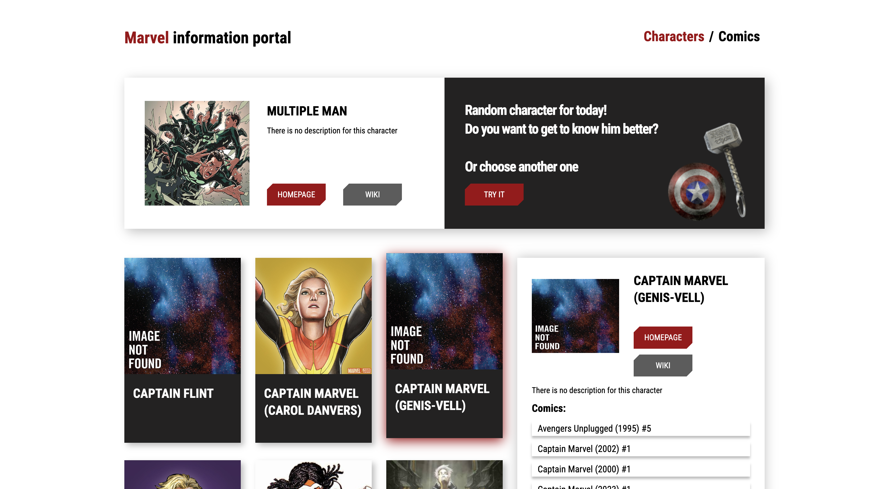

<!DOCTYPE html>
<html lang="en">
<head>
    <meta charset="UTF-8">
    <meta name="viewport" content="width=device-width, initial-scale=1.0">
</head>
<body>

    <h1 style="font-weight: bold; color: #CD5C5C">Marvel App</h1>
    
    <h2>Steps to Start the Program</h2>
    <ul>
        <li>
Prior to commencing use of this application, it is necessary to install all the requisite packages.
</li>
        <li>
A new folder must be created in the <code>src/resources</code> directory and named <code>apiKey.js</code> This folder should contain the API key and API base.
</li>
        <ul>
            <li style="list-style-type: circle; ">
API key is your own key for request
</li>
            <li style="list-style-type: circle; ">
The API base represents the fundamental root of a request, which remains unaltered as the server processes subsequent requests. To illustrate, consider the following URL: "https://gateway.marvel.com:.../public/characters?limit=9&offset=210&apikey=" (your Api Key );

            
The offset and limit values can be specified on the <a href="https://developer.marvel.com/docs">Marvel API website</a>(Please be advised that registration is required.)
</li>
        </ul>
    </ul>
  
In the project directory, you can run:

  <h3><code>yarn/npm start</code></h3>
  
Runs the app in the development mode. 
      Open <a href="http://localhost:3000" target="_blank">http://localhost:3000</a> to view it in the browser.

  
The page will reload automatically if you make changes. 
      You will also see any lint errors in the console.

  <h3><code>yarn/npm test</code></h3>
  
Launches the test runner in the interactive watch mode. 
      See the section about <a href="https://facebook.github.io/create-react-app/docs/running-tests" target="_blank">running tests</a> for more information.

  <h3><code>yarn/npm build</code></h3>
  
Builds the app for production to the <code>build</code> folder. 
      It correctly bundles React in production mode and optimizes the build for the best performance.

  
The build is minified and the filenames include the hashes. 
      Your app is ready to be deployed!

  
See the section about <a href="https://facebook.github.io/create-react-app/docs/deployment" target="_blank">deployment</a> for more information.

  <h3><code>yarn/npm eject</code></h3>
  
<strong>Note: this is a one-way operation. Once you <code>eject</code>, you can’t go back!</strong>

  
If you aren’t satisfied with the build tool and configuration choices, you can <code>eject</code> at any time. This command will remove the single build dependency from your project.

  
Instead, it will copy all the configuration files and the transitive dependencies (webpack, Babel, ESLint, etc.) right into your project so you have full control over them. All of the commands except <code>eject</code> will still work, but they will point to the copied scripts so you can tweak them. At this point you’re on your own.

  
You don’t have to ever use <code>eject</code>. The curated feature set is suitable for small and middle deployments, and you shouldn’t feel obligated to use this feature. However, we understand that this tool wouldn’t be useful if you couldn’t customize it when you are ready for it.

  <h2>Author</h2>
  <a href="https://github.com/rodionspi">rodionspi</a>

</body>
</html>
